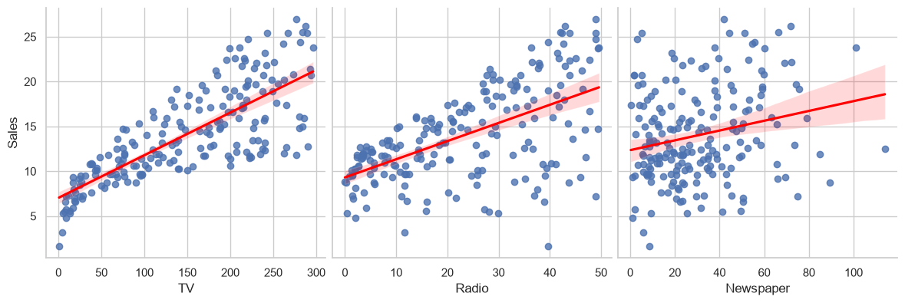

# 📈 Sales Prediction

Predicts product sales from advertising spend on TV, radio and newspapers, and identifies which channels actually drive sales, comparing linear regression with a neural network built in PyTorch.

Completed as part of the **CodeAlpha Data Science Internship**. *(Task 4)*



## 📊 Results

Evaluated on a held-out 20% test set:

| Model | RMSE (units) | MAE (units) | R² |
|---|---|---|---|
| Linear Regression (scikit-learn) | 1.782 | 1.461 | 0.899 |
| **Neural network (PyTorch)** | **0.681** | **0.447** | **0.985** |

The neural network's large gain over linear regression suggests the relationship between spend and sales isn't purely linear.

**Business insight:** TV and radio spend are the dominant drivers of sales. Newspaper spend has little predictive value and could be cut in favour of TV and radio without materially hurting sales.

## 🔬 Approach

1. **Explore:** 200 markets; spend distributions, sales-vs-spend scatter plots with trend lines, and correlations.
2. **Preprocess:** train/test split and feature standardisation.
3. **Baseline:** `LinearRegression`, with standardised coefficients to compare channels.
4. **Neural network:** a feed-forward regressor in PyTorch with training curves.
5. **Compare:** predicted-vs-actual plots and a metrics table for both models.

The PyTorch model trains on an NVIDIA GPU when CUDA is available and falls back to the CPU automatically. The dataset is small, so CPU training takes only seconds. For GPU support, install the CUDA build of PyTorch from [pytorch.org](https://pytorch.org/get-started/locally/).

## 📁 Dataset

`data/Advertising.csv`: 200 markets with TV, radio and newspaper advertising budgets (thousands of dollars) and sales (thousands of units). Source: [Kaggle: bumba5341/advertisingcsv](https://www.kaggle.com/datasets/bumba5341/advertisingcsv).

## 🚀 Run it

```bash
git clone https://github.com/salahuddinselim/CodeAlpha_Sales_Prediction.git
cd CodeAlpha_Sales_Prediction
python -m venv .venv
source .venv/bin/activate        # Windows: .venv\Scripts\activate
pip install -r requirements.txt
jupyter notebook sales_prediction.ipynb
```

Run the cells top to bottom (**Kernel → Restart & Run All**).

## 👤 Author

**Salah Uddin Selim** · [Portfolio](https://salah-uddin-selim.vercel.app) · [GitHub](https://github.com/salahuddinselim)
